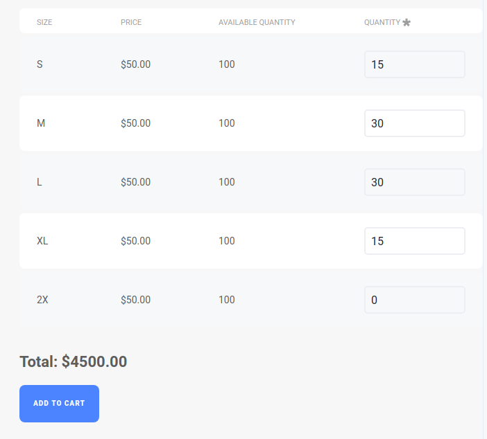
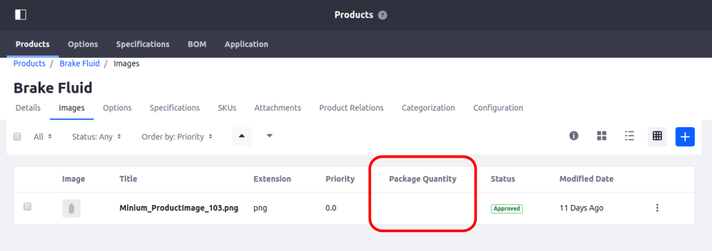
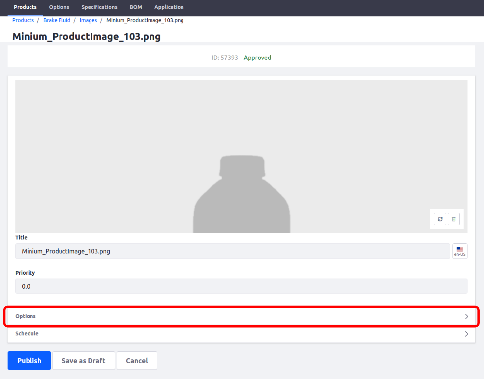

# liferay-module-examples
A repository dedicated to providing code samples for Custom Liferay modules. The modules have been tested on Liferay 7.1 and when applicable, Commerce 2.0.x.

## [commerce-custom-product-renderer](modules/commerce-custom-product-renderer)
This module follows and implements a custom product renderer following the developer documentation from [Commerce](https://commerce.liferay.dev/developer-guide/-/knowledge_base/developer/creating-a-custom-product-renderer).

## [commerce-custom-product-details](modules/commerce-custom-product-details)
This directory contains all the relevant modules, classes, and configurations to add a custom "Table" option to the Product Details Portlet. It builds off of the Minium theme view for the Product Details Portlet but can easily be adapted for your own product renderer. As there are a lot of common dependencies, I've extracted out the common ones and placed them in the root build.gradle. You can add this to the root build.gradle file of your workspace to reduce duplication.

#### [commerce-cart](modules/commerce-custom-product-details/commerce-cart)
These modules and classes are responsible for performing validation on the order items, and calculating the total price and quantity before forwarding the request to the out of the box, Commerce shopping cart.

#### [commerce-product-definitions-web-fragment](modules/commerce-custom-product-details/commerce-product-definitions-web-fragment)
This is an optional fragment that is used to modify the columns in the Images tab of a product configuration. One of the columns is used to display the specified option that the image corresponds to. If a product uses the "Table" option, which shows all options and images together, there is no need for this column. If all configured products use the "Table" option, then this column can be completely removed with this fragment. Note: This should be used in conjunction with the [CPAttachmentFileEntryDetailsOptionsFormNavigatorEntry](modules/commerce-custom-product-details/configs) blacklist config.

#### [commerce-product-service-fragment](modules/commerce-custom-product-details/commerce-product-service-fragment)
This fragment module is needed for [commerce-product-service-override](modules/commerce-custom-product-details/commerce-product-service-override) to expose the CPSkuImpl that's in one of it's internal packages.

#### [commerce-product-service-override](modules/commerce-custom-product-details/commerce-product-service-override)
When adding SKUs to a product, you need to select an option it maps to. This override is needed to render a dropdown list for our custom "Table" option. Without it, a table would show, which doesn't allow us to select anything. This override needs the original component to be blacklisted in order for it to be picked up.

#### [commerce-theme-minium-impl-fragment](modules/commerce-custom-product-details/commerce-theme-minium-impl-fragment)
This fragment module overrides the Minium themed Product Details Portlet view. It updates the "Add to Cart" button to no longer require a quantity input since that's provided by our "Table" option. It also performs some frontend validation before sending the request to our custom commerce cart portlet.

#### [commerce-theme-minium-impl-resource-override](modules/commerce-custom-product-details/commerce-theme-minium-impl-resource-override)
This simple module adds a new language key: "Added to Cart"

#### [configs](modules/commerce-custom-product-details/configs)
This directory contains two config files to ensure proper behavior for this custom option.
 * CPOptionConfiguration is used to add "Table" as a possible option you can select for product configurations.
 * ComponentBlacklistConfiguration is used to blacklist two components. 
    * CPAttachmentFileEntryDetailsOptionsFormNavigatorEntry handles the options component under the Images configuration tab for a product. If you need to configure images for specific product options/SKUs you would use this component. But if you're using the "Table" field option for all products, you would have no need for it since all images should be showing together so it needs to be blacklisted. Note: This should be used in conjunction with the [commerce-product-definitions-web-fragment](modules/commerce-custom-product-details/commerce-product-definitions-web-fragment).
 
    * CPInstanceHelperImpl is used to render the options on the "Add SKU" page. The original component needs to be blacklisted because the component policy is not greedy so a higher service ranking alone will not cause our override to be picked up. Furthermore, the place it is called, CPInstanceDisplayContext, is not an OSGi component so we can't redirect that reference to point to our override.

#### [dynamic-data-dynamic-type-table](modules/commerce-custom-product-details/dynamic-data-dynamic-type-table)
This module is based off the "Grid" DDM form field in Liferay but modified to work as a product details option.